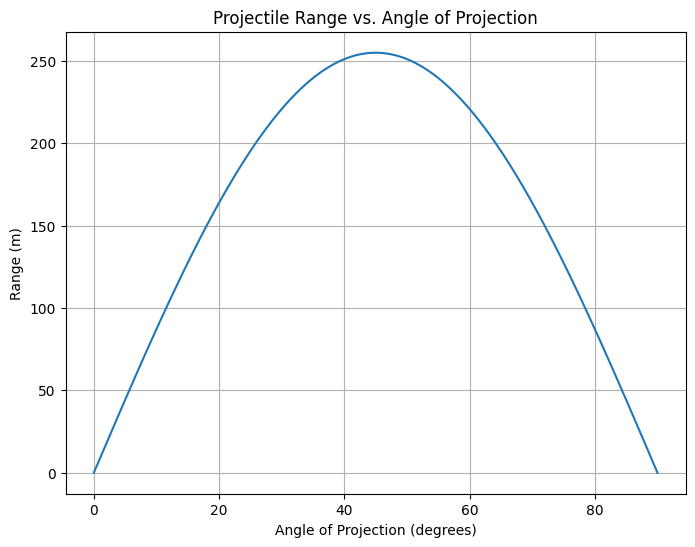

## Investigating the Range as a Function of the Angle of Projection

### 1. Theoretical Foundation

Projectile motion describes the motion of an object launched into the air, influenced only by gravitational acceleration. Let’s derive the fundamental equations governing this motion.

- **Horizontal displacement**: 
$$
 x(t) = v_0 \cos(\theta)t
$$

- **Vertical displacement**: 
$$
 y(t) = v_0 \sin(\theta)t - \frac{1}{2}gt^2
$$

Where:
$$
v_0 = \text{initial velocity}
$$

$$
\theta = \text{angle of projection}
$$

$$
g = \text{gravitational acceleration}
$$

$$
t = \text{time of flight}
$$


The time of flight $Tx$ (when the projectile returns to the same height) is given by:

$$
 T = \frac{2v_0 \sin(\theta)}{g}
$$

The horizontal range $R$ (total horizontal displacement at $y = 0$) is:

$$
 R = v_0 \cos(\theta) \times T 
$$

$$
 R = \frac{v_0^2 \sin(2\theta)}{g} 
$$

This equation shows that range depends on the square of the initial velocity, the sine of twice the projection angle, and gravitational acceleration.

### 2. Analysis of the Range

- The maximum range occurs when $\sin(2\theta)$ is maximized, i.e., when $2\theta = 90^\circ$ or $\theta = 45^\circ$.
- Increasing $v_0$ increases the range quadratically.
- Higher gravitational acceleration $g$ decreases the range.

### 3. Practical Applications

This model is idealized — in real-world applications, factors like air resistance and uneven terrain alter the projectile’s trajectory. Extensions include:

- Air resistance: Introduces drag, reducing range and altering the flight path.
- Uneven terrain: Changes the point where the projectile lands.
- Wind effects: Modify horizontal velocity.

### 4. Implementation

We can visualize the range as a function of the projection angle using Python.

```python
import numpy as np
import matplotlib.pyplot as plt

# Parameters
v0 = 50  # Initial velocity in m/s
g = 9.81  # Gravitational acceleration in m/s^2

# Angles in degrees and radians
angles = np.linspace(0, 90, 500)
theta = np.radians(angles)

# Compute range
R = (v0**2 * np.sin(2 * theta)) / g

# Plot
plt.figure(figsize=(8, 6))
plt.plot(angles, R)
plt.xlabel('Angle of Projection (degrees)')
plt.ylabel('Range (m)')
plt.title('Projectile Range vs. Angle of Projection')
plt.grid(True)
plt.show()
```



### 5. Discussion

**Limitations:**

- No air resistance considered.
- Assumes flat terrain.
- Assumes constant gravitational acceleration.

**Extensions:**

- Incorporate drag force.
- Simulate uneven landing surfaces.
- Model varying gravitational fields.

This analysis demonstrates how varying the angle of projection impacts the range of a projectile, forming a strong basis for exploring more complex real-world motion.

