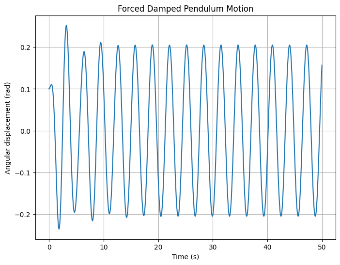

# Problem 2

## Investigating the Dynamics of a Forced Damped Pendulum

### 1. Theoretical Foundation

The forced damped pendulum is governed by the differential equation:

$$
 \frac{d^2\theta}{dt^2} + b\frac{d\theta}{dt} + \frac{g}{L}\sin\theta = A\cos(\omega t) 
$$

where:
- $\theta$ = angular displacement
- $b$ = damping coefficient
- $g$ = gravitational acceleration
- $L$ = length of the pendulum
- $A$ = amplitude of the external driving force
- $\omega$ = frequency of the external driving force
- $t$ = time

For small angles ($\theta \approx \sin\theta$), the equation simplifies to:

$\frac{d^2\theta}{dt^2} + b\frac{d\theta}{dt} + \frac{g}{L}\theta = A\cos(\omega t)$

The general solution of this equation involves both homogeneous (natural) and particular (forced) solutions. The system exhibits resonance when the driving frequency $\omega$ matches the system's natural frequency $\sqrt{g/L}$.

### 2. Analysis of Dynamics

Key parameters influencing the system’s behavior:
- **Damping coefficient (b):** Controls energy dissipation; high values lead to overdamping and slow returns to equilibrium, while low values result in underdamping and oscillations.
- **Driving amplitude (A):** Determines the intensity of the external force; larger amplitudes lead to more significant displacement and potential chaotic motion.
- **Driving frequency ($\omega$):** Controls the rate of external driving; resonance occurs when $\omega \approx \sqrt{g/L}$.

As the parameters change, the system transitions from:
- **Periodic oscillations:** Regular and predictable motion.
- **Quasiperiodic behavior:** Motion with two incommensurate frequencies.
- **Chaotic motion:** Sensitive dependence on initial conditions, leading to unpredictable outcomes.

### 3. Practical Applications

- **Energy harvesting:** Devices capturing mechanical energy from oscillations.
- **Suspension bridges:** Avoiding resonance-induced destructive oscillations.
- **Oscillating circuits:** Electrical analogs of forced damped pendulums.

### 4. Implementation

We simulate the motion of a forced damped pendulum using Python.

```python
import numpy as np
from scipy.integrate import solve_ivp
import matplotlib.pyplot as plt

# Parameters
g, L = 9.81, 1.0      # Gravity and pendulum length
b, A, omega = 0.5, 1.2, 2.0

# Differential equation
def pendulum(t, y):
    theta, omega_ = y
    dydt = [omega_, -b * omega_ - (g / L) * np.sin(theta) + A * np.cos(omega * t)]
    return dydt

# Initial conditions and time span
y0 = [0.1, 0.0]
t_span = (0, 50)
t_eval = np.linspace(*t_span, 1000)

# Solve the system
sol = solve_ivp(pendulum, t_span, y0, t_eval=t_eval)

# Plot results
plt.figure(figsize=(8, 6))
plt.plot(sol.t, sol.y[0])
plt.xlabel('Time (s)')
plt.ylabel('Angular displacement (rad)')
plt.title('Forced Damped Pendulum Motion')
plt.grid(True)
plt.show()
```


### 5. Discussion

**Limitations:**
- Assumes small-angle approximation for analytical simplicity.
- Ignores air resistance and other real-world frictions.

**Extensions:**
- Include nonlinear damping.
- Explore non-periodic driving forces.
- Visualize phase portraits and Poincaré sections.

This analysis captures the complexity of a forced damped pendulum, bridging theory and computational exploration to reveal intricate dynamics like resonance and chaos.

