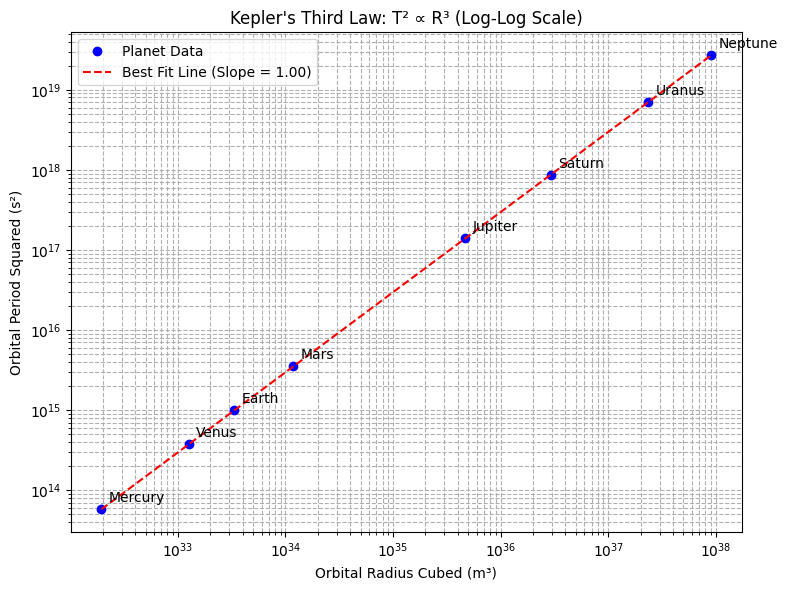
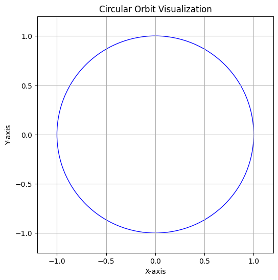

# Problem 1 — Kepler's Third Law: Orbital Period and Orbital Radius

## Derivation of the Relationship

Kepler's Third Law states that the square of the orbital period $T$ of a body is proportional to the cube of its orbital radius $r$, assuming a circular orbit.

This result can be derived using Newton’s Law of Universal Gravitation and the concept of centripetal force.

For a body of mass $m$ orbiting a much larger mass $M$ in a circular orbit of radius $r$:

### Step 1: Equating Gravitational Force to Centripetal Force

$$
 F_{\text{gravity}} = F_{\text{centripetal}} \Rightarrow \frac{GMm}{r^2} = \frac{mv^2}{r}
$$

Here, $G$ is the gravitational constant.

Cancelling the mass $m$ from both sides:

$$
 \frac{GM}{r^2} = \frac{v^2}{r}
$$

This gives:

$$
 v^2 = \frac{GM}{r}
$$

### Step 2: Expressing Orbital Velocity in Terms of Orbital Period

Since $v = \frac{2\pi r}{T}$, we substitute into the previous equation:

$$
 \left( \frac{2\pi r}{T} \right)^2 = \frac{GM}{r}
$$

Expanding and solving for $T^2$:

$$
 T^2 = \frac{4\pi^2 r^3}{GM}
$$

Thus, we obtain Kepler’s Third Law:

$$
 T^2 \propto r^3
$$

## Implications for Astronomy

1. Determination of Planetary Masses: Observing the orbital period and radius of a moon or satellite allows astronomers to calculate the mass of the planet it orbits.

2. Determination of Distances: In systems where distances are difficult to measure directly, Kepler's Law allows for the calculation of orbital radii based on observable periods.

3. Satellite Design: In Earth-orbiting satellites, their altitude directly determines their orbital period, which is critical for communication, navigation, and observational purposes.

4. Modeling of Galaxy Dynamics: Kepler's Third Law, extended with Newtonian gravity, plays a fundamental role in modeling the motion of stars around the center of galaxies.

## Real-World Examples

The Moon's Orbit Around Earth:

- Orbital radius: approximately 384,400 km.
- Orbital period: approximately 27.3 days.
- Using Kepler's Law, this relationship holds true when considering Earth's mass.


Planets in the Solar System:

- Earth's orbital radius: 1 astronomical unit (AU), orbital period: 1 year.
- Mars has an orbital radius of approximately 1.52 AU. Therefore, its period should be $T \approx \sqrt{1.52^3} \approx 1.87$ years, consistent with observations.

## Python Simulation and Verification

```python
import numpy as np
import matplotlib.pyplot as plt

# Constants
G = 6.67430e-11         # Gravitational constant (m^3 kg^-1 s^-2)
M_sun = 1.989e30        # Mass of the Sun (kg)

# Planetary data: Orbital radius in meters
planet_data = {
    "Mercury": 5.79e10,
    "Venus": 1.08e11,
    "Earth": 1.496e11,
    "Mars": 2.28e11,
    "Jupiter": 7.78e11,
    "Saturn": 1.43e12,
    "Uranus": 2.87e12,
    "Neptune": 4.50e12
}

# Extract radii
radii = np.array(list(planet_data.values()))

# Calculate periods using Kepler's Third Law
periods = np.sqrt((4 * np.pi**2 * radii**3) / (G * M_sun))

# Calculate T^2 and R^3
r3 = radii ** 3
t2 = periods ** 2

# Logarithmic values for fitting
log_r3 = np.log10(r3)
log_t2 = np.log10(t2)

# Linear fit in log-log space
coefficients = np.polyfit(log_r3, log_t2, 1)
slope, intercept = coefficients

# Compute best-fit line
fit_t2 = 10**(intercept + slope * log_r3)

# Plot
plt.figure(figsize=(8, 6))
plt.loglog(r3, t2, 'bo', label='Planet Data')
plt.loglog(r3, fit_t2, 'r--', label=f'Best Fit Line (Slope = {slope:.2f})')

# Annotate planet names
for name, r, t in zip(planet_data.keys(), r3, t2):
    plt.annotate(name, (r, t), textcoords="offset points", xytext=(5, 5), ha='left')

plt.xlabel('Orbital Radius Cubed (m³)')
plt.ylabel('Orbital Period Squared (s²)')
plt.title("Kepler's Third Law: T² ∝ R³ (Log-Log Scale)")
plt.grid(True, which='both', linestyle='--')
plt.legend()
plt.tight_layout()
plt.show()

```


## Circular Orbit Visualization

```python
fig, ax = plt.subplots(figsize=(6, 6))
circle = plt.Circle((0, 0), 1, color='blue', fill=False)
ax.add_patch(circle)
ax.set_xlim(-1.2, 1.2)
ax.set_ylim(-1.2, 1.2)
ax.set_aspect('equal')
ax.set_title("Circular Orbit Visualization")
ax.set_xlabel("X-axis")
ax.set_ylabel("Y-axis")
ax.grid(True)
plt.show()
```


## Interpretation of Results

The plot of $T^2$ versus $r^3$ on a log-log scale produces a straight line, confirming the power-law relationship predicted by Kepler’s Third Law. This consistency across the Solar System validates the universality of this relationship.

## Extension to Elliptical Orbits

Kepler’s Third Law also applies to elliptical orbits when the orbital radius is replaced by the semi-major axis $a$:

$$
 T^2 = \frac{4\pi^2 a^3}{GM}
$$

This generalization allows the application of the law to a broader range of celestial objects, including comets, asteroids, and exoplanets with highly elliptical orbits.

## Deliverables Summary

1. Explanation of Kepler’s Third Law and its derivation.
2. Discussion of implications in astronomy.
3. Real-world examples demonstrating the law.
4. Python implementation verifying the relationship between $T^2$ and $r^3$.
5. Visualization of circular orbits.
6. Extension of the discussion to elliptical orbits.

---
