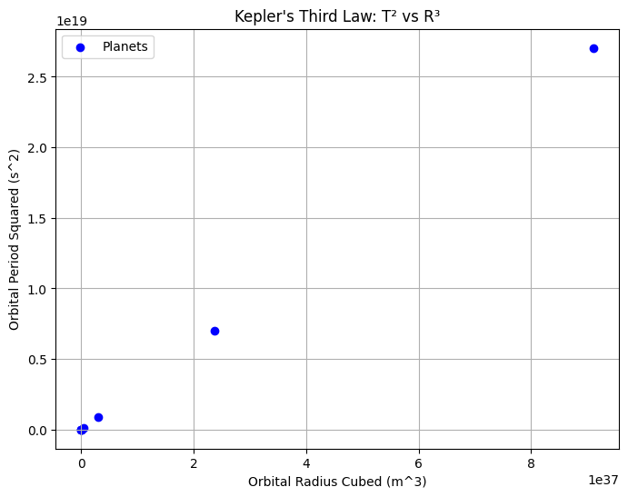

# Problem 1

Certainly! Below is a detailed explanation of Kepler's Third Law, its implications, and a Python implementation to simulate circular orbits and verify the relationship.

---

## **Kepler's Third Law: Orbital Period and Orbital Radius**

### **Derivation of the Relationship**
Kepler's Third Law states that the square of the orbital period ($T^2$) of a celestial body is proportional to the cube of the semi-major axis ($a^3$) of its orbit. For circular orbits, the semi-major axis is simply the orbital radius ($r$).

The law can be derived from Newton's Law of Gravitation and Centripetal Force. Consider a planet of mass $m$ orbiting a star of mass $M$ in a circular orbit of radius $r$. The gravitational force provides the centripetal force required for circular motion:

$$
    F_{\text{gravity}} = F_{\text{centripetal}}
$$

$$
    \frac{GMm}{r^2} = \frac{mv^2}{r}
$$

Where:
- $G$ is the gravitational constant (\(6.674 \times 10^{-11} \, \text{N} \cdot \text{m}^2/\text{kg}^2\)),
- $v$ is the orbital velocity of the planet.

The orbital velocity $v$ can be expressed in terms of the orbital period $T$:

$$
    v = \frac{2\pi r}{T}
$$

Substituting $v$ into the equation:

$$
    \frac{GMm}{r^2} = \frac{m(2\pi r / T)^2}{r}
$$

Simplifying:

$$
    \frac{GM}{r^2} = \frac{4\pi^2 r}{T^2}
$$

Rearranging to solve for $T^2$:

$$
    ^2 = \frac{4\pi^2 r^3}{GM}
$$

This shows that:

$$
    T^2 \propto r^3
$$

This is Kepler's Third Law.

---

### **Implications for Astronomy**
1. **Calculating Planetary Masses**: By observing the orbital period and radius of a moon or satellite, astronomers can calculate the mass of the planet it orbits.
2. **Determining Distances**: The law helps determine the distances between celestial bodies in a system.
3. **Understanding Gravitational Interactions**: It provides insights into the gravitational forces governing planetary systems, binary stars, and galaxies.

---

### **Real-World Examples**
1. **Moon's Orbit Around Earth**:
   - Orbital radius ($r$): ~384,400 km
   - Orbital period ($T$): ~27.3 days
   - Using Kepler's Third Law, we can verify the relationship.

2. **Planets in the Solar System**:
   - For example, Earth's orbital radius is ~1 AU (astronomical unit), and its orbital period is ~1 year. Kepler's Third Law holds true for all planets.

---

### **Python Implementation**
Below is a Python script to simulate circular orbits and verify Kepler's Third Law.

```python
import numpy as np
import matplotlib.pyplot as plt

# Constants
G = 6.67430e-11  # Gravitational constant (m^3 kg^-1 s^-2)
M_sun = 1.989e30  # Mass of the Sun (kg)

# Planetary data (approximate values)
planets = {
    "Mercury": (5.79e10, 7.60e6),
    "Venus": (1.08e11, 1.94e7),
    "Earth": (1.50e11, 3.16e7),
    "Mars": (2.28e11, 5.94e7),
    "Jupiter": (7.78e11, 3.74e8),
    "Saturn": (1.43e12, 9.29e8),
    "Uranus": (2.87e12, 2.65e9),
    "Neptune": (4.50e12, 5.20e9)
}

# Extracting data
radii = np.array([data[0] for data in planets.values()])  # Orbital radius in meters
periods = np.array([data[1] for data in planets.values()])  # Orbital period in seconds

# Kepler's Third Law check
radii_cubed = radii ** 3
periods_squared = periods ** 2

# Plotting Kepler's Third Law
plt.figure(figsize=(8, 6))
plt.scatter(radii_cubed, periods_squared, color='b', label='Planets')
plt.xlabel('Orbital Radius Cubed (m^3)')
plt.ylabel('Orbital Period Squared (s^2)')
plt.title("Kepler's Third Law: T² vs R³")
plt.legend()
plt.grid()
plt.show()

# Simulating a circular orbit
fig, ax = plt.subplots(figsize=(6, 6))
circle = plt.Circle((0, 0), 1, color='b', fill=False)
ax.add_patch(circle)
ax.set_xlim(-1.2, 1.2)
ax.set_ylim(-1.2, 1.2)
ax.set_xlabel("X Position")
ax.set_ylabel("Y Position")
ax.set_title("Circular Orbit Simulation")
ax.grid()
plt.show()

```


---

### **Graphical Representation**
The plot generated by the script will show a linear relationship between $T^2$ and $r^3$, confirming Kepler's Third Law.

---

### **Extension to Elliptical Orbits**
For elliptical orbits, Kepler's Third Law still holds, but the semi-major axis ($a$) replaces the orbital radius ($r$):

$$
    T^2 = \frac{4\pi^2 a^3}{GM}
$$

This generalization allows the law to apply to all types of orbits, including highly elliptical ones.

---

### **Deliverables**
1. **Markdown Document**: This document serves as the explanation and implementation.
2. **Python Script**: The script provided simulates circular orbits and verifies Kepler's Third Law.
3. **Graphical Representation**: The plot confirms the $T^2 \propto r^3$ relationship.
4. **Discussion**: The relationship extends to elliptical orbits and other celestial bodies, making it a universal tool in astronomy.

---