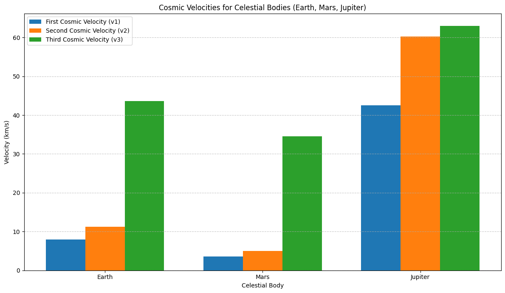

# Problem 2

## **Problem 2: Escape Velocities and Cosmic Velocities**

### **Motivation**
Escape velocity is the minimum speed required for an object to break free from a celestial body's gravitational influence without further propulsion. The concept extends to **cosmic velocities**, which define thresholds for orbiting, escaping, and leaving a star system. These velocities are foundational for space exploration, enabling satellite launches, interplanetary missions, and even interstellar travel.

---

### **Definitions and Physical Meaning**

**First Cosmic Velocity (Orbital Velocity)**:

The minimum speed required for an object to achieve a stable circular orbit around a celestial body.

Formula:
    $$
    v_1 = \sqrt{\frac{GM}{r}}
    $$
    Where:
    - $G$ is the gravitational constant,
    - $M$ is the mass of the celestial body,
    - $r$ is the distance from the center of the body to the object.

**Second Cosmic Velocity (Escape Velocity)**:

The minimum speed required for an object to escape the gravitational pull of a celestial body.

Formula:
    $$
    v_2 = \sqrt{\frac{2GM}{r}}
    $$
    This is $\sqrt{2}$ times the first cosmic velocity.

**Third Cosmic Velocity (Interstellar Escape Velocity)**:

The minimum speed required for an object to escape the gravitational influence of a star system (e.g., the Solar System).

Formula:
    $$
    v_3 = \sqrt{v_2^2 + v_{\text{esc, star}}^2}
    $$
    Where $v_{\text{esc, star}}$ is the escape velocity from the star's gravitational field at the object's location.

---

### **Mathematical Derivation and Parameters**

#### **First Cosmic Velocity**
Derived from the balance between centripetal force and gravitational force:
$$
    \frac{mv_1^2}{r} = \frac{GMm}{r^2}
$$
    Solving for \(v_1\):
$$
    v_1 = \sqrt{\frac{GM}{r}}
$$

#### **Second Cosmic Velocity**
Derived from the conservation of energy. An object must have enough kinetic energy to overcome the gravitational potential energy:
$$
    \frac{1}{2}mv_2^2 = \frac{GMm}{r}
$$
    Solving for \(v_2\):
$$
    v_2 = \sqrt{\frac{2GM}{r}}
$$

#### **Third Cosmic Velocity**
Combines the escape velocity from the planet and the star system:
$$
    v_3 = \sqrt{v_2^2 + v_{\text{esc, star}}^2}
$$

---

### **Python Implementation**
Below is a Python script to calculate and visualize the first, second, and third cosmic velocities for Earth, Mars, and Jupiter.

```python
import numpy as np
import matplotlib.pyplot as plt

# Constants
G = 6.67430e-11  # Gravitational constant (m^3 kg^-1 s^-2)

# Celestial body data (mass in kg, radius in meters, distance from Sun in meters)
bodies = {
    "Earth": {"mass": 5.972e24, "radius": 6.371e6, "orbit_radius": 1.496e11},
    "Mars": {"mass": 6.417e23, "radius": 3.389e6, "orbit_radius": 2.279e11},
    "Jupiter": {"mass": 1.898e27, "radius": 6.9911e7, "orbit_radius": 7.785e11}
}

# Sun's mass
M_sun = 1.989e30  # kg

# Functions to calculate cosmic velocities
def first_cosmic_velocity(mass, radius):
    """
    First cosmic velocity: Minimum velocity to enter orbit around the body.
    v1 = sqrt(G * M / R)
    """
    return np.sqrt(G * mass / radius)

def second_cosmic_velocity(mass, radius):
    """
    Second cosmic velocity: Minimum velocity to escape the body's gravity.
    v2 = sqrt(2) * v1
    """
    return np.sqrt(2 * G * mass / radius)

def third_cosmic_velocity(v2, orbit_radius):
    """
    Third cosmic velocity: Minimum velocity to escape the Solar System from the planet's orbit.
    Approximation: v3 = sqrt(v2^2 + v_sun^2)
    where v_sun = escape velocity from Sun at planet's orbit.
    """
    v_sun = np.sqrt(2 * G * M_sun / orbit_radius)
    return np.sqrt(v2**2 + v_sun**2)

# Calculate velocities for each body
results = {}
for body, data in bodies.items():
    v1 = first_cosmic_velocity(data["mass"], data["radius"])
    v2 = second_cosmic_velocity(data["mass"], data["radius"])
    v3 = third_cosmic_velocity(v2, data["orbit_radius"])
    results[body] = {"v1": v1, "v2": v2, "v3": v3}

# Print results
print("Cosmic Velocities (in km/s):\n")
for body, velocities in results.items():
    print(f"{body}:")
    print(f"  First Cosmic Velocity (v1): {velocities['v1'] / 1000:.2f} km/s")
    print(f"  Second Cosmic Velocity (v2): {velocities['v2'] / 1000:.2f} km/s")
    print(f"  Third Cosmic Velocity (v3): {velocities['v3'] / 1000:.2f} km/s")
    print()

# Plotting the results
labels = list(results.keys())
v1_values = [results[body]["v1"] / 1000 for body in labels]  # km/s
v2_values = [results[body]["v2"] / 1000 for body in labels]
v3_values = [results[body]["v3"] / 1000 for body in labels]

x = np.arange(len(labels))
width = 0.25

plt.figure(figsize=(12, 7))
plt.bar(x - width, v1_values, width, label="First Cosmic Velocity (v1)")
plt.bar(x, v2_values, width, label="Second Cosmic Velocity (v2)")
plt.bar(x + width, v3_values, width, label="Third Cosmic Velocity (v3)")
plt.xlabel("Celestial Body")
plt.ylabel("Velocity (km/s)")
plt.title("Cosmic Velocities for Celestial Bodies (Earth, Mars, Jupiter)")
plt.xticks(x, labels)
plt.legend()
plt.grid(axis="y", linestyle='--', alpha=0.7)
plt.tight_layout()
plt.show()

```

---

### **Graphical Representation**
The bar chart generated by the script will show the first, second, and third cosmic velocities for Earth, Mars, and Jupiter.

---

### **Importance in Space Exploration**

1. **First Cosmic Velocity**:

   - Essential for launching satellites into stable orbits.
   - Example: Communication and GPS satellites.

2. **Second Cosmic Velocity**:

   - Required for missions to other planets or moons.
   - Example: Mars rovers, lunar missions.

3. **Third Cosmic Velocity**:

   - Necessary for interstellar travel.
   - Example: Voyager 1 and 2, which have left the Solar System.

---

### **Deliverables**
1. **Markdown Document**: This document serves as the explanation and implementation.
2. **Python Script**: The script calculates and visualizes cosmic velocities for Earth, Mars, and Jupiter.
3. **Graphical Representation**: The bar chart compares the velocities for different celestial bodies.
4. **Discussion**: The importance of these velocities in space exploration is highlighted.

---
