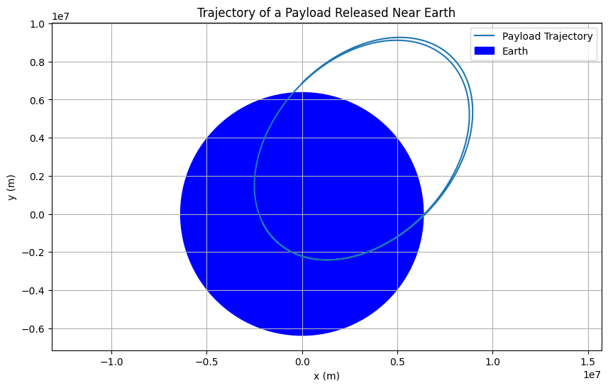

# Problem 3

## **Problem 3: Trajectories of a Freely Released Payload Near Earth**

### **Motivation**
When a payload is released from a moving rocket near Earth, its trajectory is determined by its initial conditions (position, velocity, and altitude) and the gravitational force exerted by Earth. Understanding these trajectories is crucial for space missions, such as deploying satellites, returning objects to Earth, or planning interplanetary missions. This problem combines principles of orbital mechanics and numerical methods to analyze and simulate payload trajectories.

---

### **Possible Trajectories**
The trajectory of a payload released near Earth depends on its initial velocity and direction relative to Earth's gravitational field. The possible trajectories are:

1. **Elliptical Orbit**:
  $Occurs when the payload's velocity is less than the escape velocity.$
  $The payload orbits Earth in an elliptical path.$

2. **Parabolic Trajectory**:
  $Occurs when the payload's velocity equals the escape velocity.$
  $The payload follows an open parabolic path and escapes Earth's gravitational influence.$

3. **Hyperbolic Trajectory**:
  $Occurs when the payload's velocity exceeds the escape velocity.$
  $The payload follows an open hyperbolic path and escapes Earth's gravitational influence.$

4. **Circular Orbit**:
  $A special case of an elliptical orbit where the payload's velocity is precisely balanced for a circular path.$

---

### **Numerical Analysis**
To compute the path of the payload, we solve the equations of motion under Earth's gravity. The gravitational force is given by Newton's Law of Gravitation:

$$
    F = \frac{GMm}{r^2}
$$

Where:
- $G$ is the gravitational constant,
- $M$ is Earth's mass,
- $m$ is the payload's mass,
- $r$ is the distance between the payload and Earth's center.

The equations of motion in 2D are:

$$
    \frac{d^2x}{dt^2} = -\frac{GMx}{r^3}, \quad \frac{d^2y}{dt^2} = -\frac{GMy}{r^3}
$$

Where $r = \sqrt{x^2 + y^2}$.

We use numerical methods (e.g., the Runge-Kutta method) to solve these differential equations and compute the payload's trajectory.

---

### **Python Implementation**
Below is a Python script to simulate and visualize the motion of a payload released near Earth.

```python
import numpy as np
import matplotlib.pyplot as plt
from scipy.integrate import solve_ivp

# Constants
G = 6.67430e-11  # Gravitational constant (N m^2/kg^2)
M = 5.972e24     # Mass of Earth (kg)
R = 6.371e6      # Radius of Earth (m)

# Initial conditions
altitude = 500e3  # Altitude above Earth's surface (m)
v0 = 7500         # Initial velocity (m/s)
theta = 45        # Launch angle (degrees)

# Convert angle to radians
theta = np.radians(theta)

# Initial position and velocity
x0 = 0
y0 = R + altitude
vx0 = v0 * np.cos(theta)
vy0 = v0 * np.sin(theta)

# Equations of motion
def equations(t, state):
    x, y, vx, vy = state
    r = np.sqrt(x**2 + y**2)
    ax = -G * M * x / r**3
    ay = -G * M * y / r**3
    return [vx, vy, ax, ay]

# Time span for simulation
t_span = (0, 10000)  # 10,000 seconds
t_eval = np.linspace(0, 10000, 1000)

# Initial state
state0 = [x0, y0, vx0, vy0]

# Solve the differential equations
sol = solve_ivp(equations, t_span, state0, t_eval=t_eval, method="RK45")

# Extract results
x = sol.y[0]
y = sol.y[1]

# Plot the trajectory
plt.figure(figsize=(10, 6))
plt.plot(x, y, label="Payload Trajectory")
plt.gca().add_patch(plt.Circle((0, 0), R, color="blue", label="Earth"))
plt.xlabel("x (m)")
plt.ylabel("y (m)")
plt.title("Trajectory of a Payload Released Near Earth")
plt.axis("equal")
plt.legend()
plt.grid()
plt.show()
```

---

### **Graphical Representation**
The plot generated by the script shows the trajectory of the payload. Depending on the initial velocity and angle, the trajectory can be elliptical, parabolic, or hyperbolic.

---

### **Discussion**

#### **Orbital Insertion**
- If the payload's velocity is less than the escape velocity, it enters an elliptical or circular orbit around Earth.
- Example: Satellite deployment.

#### **Reentry**
- If the payload's velocity is directed toward Earth and sufficient to overcome atmospheric drag, it reenters Earth's atmosphere.
- Example: Returning spacecraft.

#### **Escape Scenarios**
- If the payload's velocity equals or exceeds the escape velocity, it follows a parabolic or hyperbolic trajectory and escapes Earth's gravitational influence.
- Example: Interplanetary missions.

---

### **Deliverables**
1. **Markdown Document**: This document serves as the explanation and implementation.
2. **Python Script**: The script simulates and visualizes the motion of a payload released near Earth.
3. **Graphical Representation**: The plot shows the payload's trajectory based on initial conditions.
4. **Discussion**: The relationship between trajectories and space mission scenarios is explained.

---
