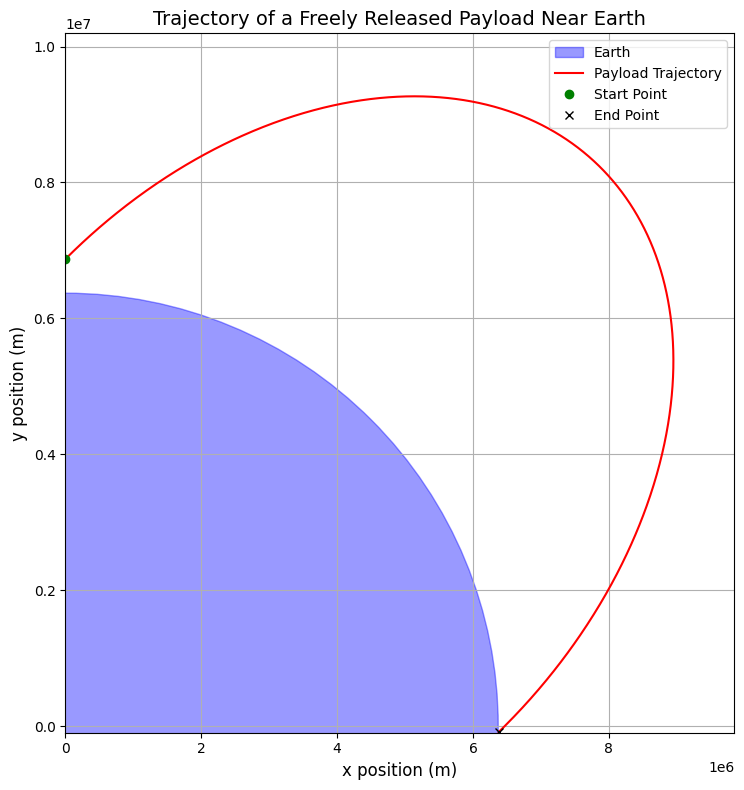
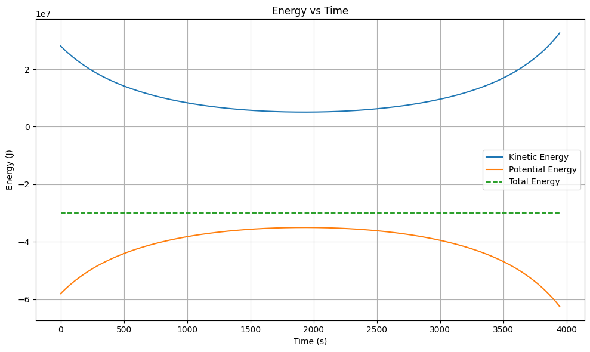

# Problem 3

## **Problem 3: Trajectories of a Freely Released Payload Near Earth**

### **Motivation**
When a payload is released from a moving rocket near Earth, its trajectory is determined by its initial conditions (position, velocity, and altitude) and the gravitational force exerted by Earth. Understanding these trajectories is crucial for space missions, such as deploying satellites, returning objects to Earth, or planning interplanetary missions. This problem combines principles of orbital mechanics and numerical methods to analyze and simulate payload trajectories.

---

### **Possible Trajectories**
The trajectory of a payload released near Earth depends on its initial velocity and direction relative to Earth's gravitational field. The possible trajectories are:

**Elliptical Orbit**

Occurs when the payload’s velocity is less than the escape velocity.
The payload orbits Earth in an elliptical path.

**Parabolic Trajectory**

Occurs when the payload’s velocity equals the escape velocity.
The payload follows an open parabolic path and escapes Earth's gravitational influence.

**Hyperbolic Trajectory**

Occurs when the payload’s velocity exceeds the escape velocity.
The payload follows an open hyperbolic path and escapes Earth's gravitational influence.

**Circular Orbit**

A special case of an elliptical orbit where the payload’s velocity is precisely balanced for a circular path.

---

### **Numerical Analysis**
To compute the path of the payload, we solve the equations of motion under Earth's gravity. The gravitational force is given by Newton's Law of Gravitation:

$$
    F = \frac{GMm}{r^2}
$$

Where:
- $G$ is the gravitational constant,
- $M$ is Earth's mass,
- $m$ is the payload's mass,
- $r$ is the distance between the payload and Earth's center.

The equations of motion in 2D are:

$$
    \frac{d^2x}{dt^2} = -\frac{GMx}{r^3}, \quad \frac{d^2y}{dt^2} = -\frac{GMy}{r^3}
$$

Where $r = \sqrt{x^2 + y^2}$.

We use numerical methods (e.g., the Runge-Kutta method) to solve these differential equations and compute the payload's trajectory.

---

### **Python Implementation**
Below is a Python script to simulate and visualize the motion of a payload released near Earth.

```python
import numpy as np
import matplotlib.pyplot as plt
from scipy.integrate import solve_ivp

# === Constants ===
G = 6.67430e-11       # Gravitational constant (m^3 kg^-1 s^-2)
M_earth = 5.972e24    # Mass of Earth (kg)
R_earth = 6.371e6     # Radius of Earth (m)
mu = G * M_earth      # Standard gravitational parameter (m^3/s^2)

# === Utility Functions ===
def compute_escape_velocity(r):
    return np.sqrt(2 * mu / r)

def compute_orbital_velocity(r):
    return np.sqrt(mu / r)

def kinetic_energy(v, m=1):
    return 0.5 * m * v**2

def potential_energy(r, m=1):
    return -mu * m / r

def total_energy(r, v, m=1):
    return kinetic_energy(v, m) + potential_energy(r, m)

def classify_trajectory(energy):
    if energy < 0:
        return "Bound Orbit (Elliptical or Circular)"
    elif np.isclose(energy, 0, atol=1e-5):
        return "Parabolic Trajectory"
    else:
        return "Escape Trajectory (Hyperbolic)"

# === Initial Conditions ===
altitude = 500e3        # Altitude above Earth's surface (m)
v0 = 7500               # Initial speed (m/s)
angle_deg = 45          # Launch angle from horizontal (degrees)

# Convert angle to radians for calculations
angle_rad = np.radians(angle_deg)

# Initial position (x0, y0) and velocity components (vx0, vy0)
x0 = 0
y0 = R_earth + altitude
vx0 = v0 * np.cos(angle_rad)
vy0 = v0 * np.sin(angle_rad)

# === Define Equations of Motion ===
def equations(t, state):
    x, y, vx, vy = state
    r = np.sqrt(x**2 + y**2)
    ax = -mu * x / r**3
    ay = -mu * y / r**3
    return [vx, vy, ax, ay]

# === Define Event to Detect Earth Impact ===
def hit_ground(t, state):
    x, y, _, _ = state
    r = np.sqrt(x**2 + y**2)
    return r - R_earth
hit_ground.terminal = True  # Stop the integration
hit_ground.direction = -1   # Detect only when approaching Earth

# === Time Span and Evaluation Points ===
t_max = 20000  # Maximum simulation time in seconds
t_points = 5000
t_span = (0, t_max)
t_eval = np.linspace(*t_span, t_points)

# === Initial State Vector ===
initial_state = [x0, y0, vx0, vy0]

# === Solve ODE ===
solution = solve_ivp(
    fun=equations,
    t_span=t_span,
    y0=initial_state,
    t_eval=t_eval,
    method="RK45",
    events=hit_ground,
    rtol=1e-9,
    atol=1e-10
)

# === Extract Results ===
x, y = solution.y[0], solution.y[1]
vx, vy = solution.y[2], solution.y[3]
t = solution.t

# === Plotting Functions ===
def plot_trajectory(x, y):
    fig, ax = plt.subplots(figsize=(10, 8))
    earth = plt.Circle((0, 0), R_earth, color='blue', alpha=0.4, label='Earth')
    ax.add_artist(earth)
    ax.plot(x, y, color='red', label='Payload Trajectory')
    ax.plot(x[0], y[0], 'go', label='Start Point')
    ax.plot(x[-1], y[-1], 'kx', label='End Point')
    ax.set_aspect('equal')
    ax.set_xlim(min(x)*1.1, max(x)*1.1)
    ax.set_ylim(min(y)*1.1, max(y)*1.1)
    ax.set_xlabel('x position (m)', fontsize=12)
    ax.set_ylabel('y position (m)', fontsize=12)
    ax.set_title('Trajectory of a Freely Released Payload Near Earth', fontsize=14)
    ax.legend()
    ax.grid(True)
    plt.tight_layout()
    plt.savefig("trajectory.png")  # Save image
    plt.show()

def plot_energy(t, x, y, vx, vy):
    r = np.sqrt(x**2 + y**2)
    v = np.sqrt(vx**2 + vy**2)
    ke = kinetic_energy(v)
    pe = potential_energy(r)
    te = ke + pe
    plt.figure(figsize=(10, 6))
    plt.plot(t, ke, label='Kinetic Energy')
    plt.plot(t, pe, label='Potential Energy')
    plt.plot(t, te, label='Total Energy', linestyle='--')
    plt.xlabel('Time (s)')
    plt.ylabel('Energy (J)')
    plt.title('Energy vs Time')
    plt.legend()
    plt.grid(True)
    plt.tight_layout()
    plt.savefig("energy_plot.png")  # Save image
    plt.show()

# === Run Visualizations ===
plot_trajectory(x, y)
plot_energy(t, x, y, vx, vy)

# === Output Results ===
r0 = np.sqrt(x0**2 + y0**2)
v_initial = np.sqrt(vx0**2 + vy0**2)
e_initial = total_energy(r0, v_initial)
traj_type = classify_trajectory(e_initial)

print(f"Initial speed: {v_initial:.2f} m/s")
print(f"Escape velocity at {altitude/1000:.0f} km: {compute_escape_velocity(R_earth + altitude):.2f} m/s")
print(f"Orbital velocity at {altitude/1000:.0f} km: {compute_orbital_velocity(R_earth + altitude):.2f} m/s")
print(f"Initial total mechanical energy: {e_initial:.2e} J")
print(f"Predicted trajectory type: {traj_type}")

if solution.status == 1:
    impact_time = solution.t_events[0][0]
    print(f"\nPayload impacted Earth at t = {impact_time:.2f} seconds.")
    print(f"Impact location: x = {x[-1]:.2f} m, y = {y[-1]:.2f} m")
else:
    print("\nPayload did not impact Earth within simulation time.")
    print(f"Final location: x = {x[-1]:.2f} m, y = {y[-1]:.2f} m")

```


---

### **Graphical Representation**
The plot generated by the script shows the trajectory of the payload. Depending on the initial velocity and angle, the trajectory can be elliptical, parabolic, or hyperbolic.

---

### **Discussion**

#### **Orbital Insertion**

- If the payload's velocity is less than the escape velocity, it enters an elliptical or circular orbit around Earth.
- Example: Satellite deployment.

#### **Reentry**

- If the payload's velocity is directed toward Earth and sufficient to overcome atmospheric drag, it reenters Earth's atmosphere.
- Example: Returning spacecraft.

#### **Escape Scenarios**

- If the payload's velocity equals or exceeds the escape velocity, it follows a parabolic or hyperbolic trajectory and escapes Earth's gravitational influence.
- Example: Interplanetary missions.

---

### **Deliverables**
1. **Markdown Document**: This document serves as the explanation and implementation.
2. **Python Script**: The script simulates and visualizes the motion of a payload released near Earth.
3. **Graphical Representation**: The plot shows the payload's trajectory based on initial conditions.
4. **Discussion**: The relationship between trajectories and space mission scenarios is explained.

---
