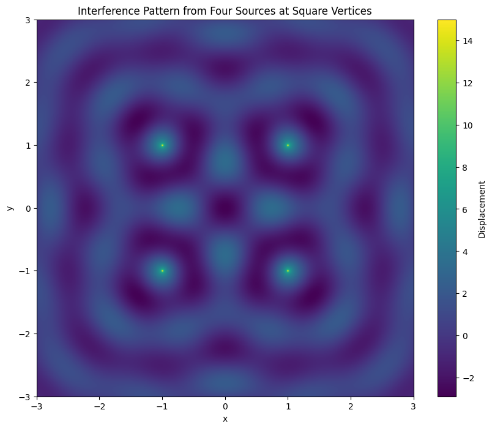

# Problem 1

To analyze the interference patterns formed by waves emitted from point sources placed at the vertices of a regular polygon, we can follow the steps outlined in the problem statement. Let's choose a square as our regular polygon for this analysis. Here's how we can approach the problem:

### Step 1: Select a Regular Polygon
We choose a square with four vertices.

### Step 2: Position the Sources
Place point wave sources at each of the four vertices of the square. Let's assume the square has a side length of \( L \), and its center is at the origin \((0, 0)\). The coordinates of the vertices are:
- $(L/2, L/2)$
- $(-L/2, L/2)$
- $(-L/2, -L/2)$
- $(L/2, -L/2)$

### Step 3: Wave Equations
The wave emitted from each source can be described by the equation:
$$
\eta_i(x, y, t) = \frac{A}{\sqrt{r_i}} \cdot \cos(k r_i - \omega t + \phi_i)
$$
where $r_i = \sqrt{(x - x_i)^2 + (y - y_i)^2}$ is the distance from the $i$-th source to the point $(x, y)$, and $\phi_i$ is the initial phase of the $i$-th source.

### Step 4: Superposition of Waves
The total displacement at any point \((x, y)\) on the water surface is the sum of the displacements from all four sources:
$$
    \eta_{\text{sum}}(x, y, t) = \sum_{i=1}^{4} \eta_i(x, y, t)
$$

### Step 5: Analyze Interference Patterns
We need to examine the resulting displacement $\eta_{\text{sum}}(x, y, t)$ to identify regions of constructive and destructive interference.

### Step 6: Visualization
We can use Python with Matplotlib to visualize the interference patterns. Here's a Python script to simulate and visualize the interference patterns:

```python
import numpy as np
import matplotlib.pyplot as plt

# Parameters
A = 1.0  # Amplitude
wavelength = 1.0  # Wavelength
k = 2 * np.pi / wavelength  # Wave number
omega = 2 * np.pi  # Angular frequency
L = 2.0  # Side length of the square
phi = 0  # Initial phase

# Source positions for a square
sources = [(L/2, L/2), (-L/2, L/2), (-L/2, -L/2), (L/2, -L/2)]

# Create a grid for visualization
x = np.linspace(-3, 3, 500)
y = np.linspace(-3, 3, 500)
X, Y = np.meshgrid(x, y)
Z = np.zeros_like(X)

# Time (assuming a snapshot at t=0 for simplicity)
t = 0

# Function to calculate wave displacement from a single source
def wave_displacement(x, y, x0, y0, t):
    r = np.sqrt((x - x0)**2 + (y - y0)**2)
    return (A / np.sqrt(r)) * np.cos(k * r - omega * t + phi)

# Superposition of waves from all sources
for (x0, y0) in sources:
    Z += wave_displacement(X, Y, x0, y0, t)

# Plotting the interference pattern
plt.figure(figsize=(10, 8))
plt.imshow(Z, extent=(-3, 3, -3, 3), origin='lower', cmap='viridis')
plt.colorbar(label='Displacement')
plt.title('Interference Pattern from Four Sources at Square Vertices')
plt.xlabel('x')
plt.ylabel('y')
plt.show()
```


### Deliverables
1. **Markdown Document**: This document includes the Python script and a detailed explanation of the interference patterns observed.
2. **Explanation**: The script simulates the interference pattern from four coherent sources placed at the vertices of a square. The resulting pattern shows regions of constructive interference (bright areas) and destructive interference (dark areas).
3. **Graphical Representations**: The plot generated by the script visually represents the interference pattern on the water surface.

This approach provides a clear understanding of wave superposition and interference patterns using a regular polygon configuration.