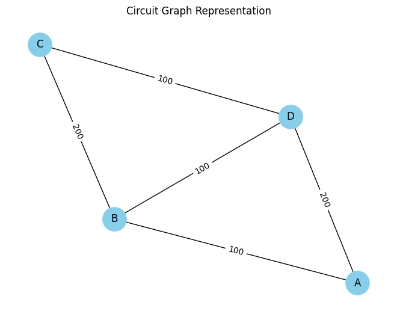

## Problem 1: Equivalent Resistance Using Graph Theory

### Motivation
Equivalent resistance calculations are fundamental in electrical engineering, crucial for understanding circuit behavior and optimizing design. Traditional methods using iterative series and parallel simplifications become cumbersome and error-prone for complex circuits. Graph theory provides an elegant, systematic, and algorithmic alternative, capable of handling intricate resistor networks with ease and precision. This approach not only enhances clarity and simplifies calculations but is also highly beneficial for automated circuit analysis and simulation software.

### Task Option Chosen
For this task, I selected **Option 2: Advanced Task – Full Implementation**. This involves developing a full Python implementation capable of handling arbitrary resistor configurations, including nested series and parallel connections.

### Definitions and Conceptual Explanation
- **Series connection**: Two resistors in series share a single node exclusively, with no other connections branching off between them. Equivalent resistance:
$R_{eq} = R_1 + R_2$

- **Parallel connection**: Two resistors in parallel share both their start and end nodes. Equivalent resistance:
$\frac{1}{R_{eq}} = \frac{1}{R_1} + \frac{1}{R_2}$

### Graph Representation
A circuit can be represented as a graph $G(V, E)$:
- **Vertices (V)**: Junction points in the circuit.
- **Edges (E)**: Resistors with resistance values as edge weights.

### Detailed Algorithm Description

The algorithm systematically simplifies the circuit by iteratively reducing series and parallel resistor combinations until a single equivalent resistor remains:

1. **Series Reduction**:
   - Find nodes with exactly two connections (degree-2 nodes).
   - Combine connected resistors using the series formula.
   
2. **Parallel Reduction**:
   - Identify nodes pairs connected by multiple edges (parallel resistors).
   - Combine resistors using the parallel formula.

### Python Implementation
Below is the Python implementation using the `networkx` library for graph operations:

```python
import networkx as nx

# Series simplification function
def reduce_series(G):
    reduced = False
    for node in list(G.nodes):
        if G.degree(node) == 2:
            neighbors = list(G.neighbors(node))
            if neighbors[0] != neighbors[1]:
                r1 = G.edges[node, neighbors[0]]['weight']
                r2 = G.edges[node, neighbors[1]]['weight']
                new_r = r1 + r2
                G.add_edge(neighbors[0], neighbors[1], weight=new_r)
                G.remove_node(node)
                reduced = True
    return reduced

# Parallel simplification function
def reduce_parallel(G):
    reduced = False
    edges_seen = set()
    for u, v in list(G.edges):
        if (u, v) in edges_seen or (v, u) in edges_seen:
            continue
        parallel_edges = list(G.get_edge_data(u, v).items())
        if len(parallel_edges) > 1:
            inv_r_sum = sum([1 / data['weight'] for _, data in parallel_edges])
            new_r = 1 / inv_r_sum
            G.remove_edges_from([(u, v) for _, _ in parallel_edges])
            G.add_edge(u, v, weight=new_r)
            reduced = True
        edges_seen.add((u, v))
    return reduced

# Calculate equivalent resistance
def equivalent_resistance(G):
    G = G.copy()
    while True:
        series_reduced = reduce_series(G)
        parallel_reduced = reduce_parallel(G)
        if not (series_reduced or parallel_reduced):
            break
    if len(G.edges) == 1:
        return list(G.edges(data='weight'))[0][2]
    else:
        raise ValueError("Unable to simplify further.")

# Example Circuit
G = nx.MultiGraph()
G.add_edge('A', 'B', weight=100)
G.add_edge('B', 'C', weight=200)
G.add_edge('C', 'D', weight=100)
G.add_edge('D', 'A', weight=200)
G.add_edge('B', 'D', weight=100)

R_eq = equivalent_resistance(G)
print(f"Equivalent Resistance: {R_eq} Ω")
```

### Example Circuits and Analysis
- **Simple Series**: 10Ω and 20Ω series → $R_{eq} = 30Ω$
- **Simple Parallel**: 10Ω and 20Ω parallel → $R_{eq} = 6.67Ω$
- **Nested Configuration**: 10Ω series with two parallel resistors (20Ω each) → $R_{eq} = 20Ω$

### Graphical Representation
Visualization of the circuit using NetworkX for clarity:
```python
import matplotlib.pyplot as plt

pos = nx.spring_layout(G)
nx.draw(G, pos, with_labels=True, node_color='skyblue', node_size=800)
nx.draw_networkx_edge_labels(G, pos, edge_labels={(u,v):d['weight'] for u,v,d in G.edges(data=True)})
plt.title("Circuit Graph Representation")
plt.show()
```


### Algorithm Efficiency and Potential Improvements
- **Complexity**: Typically $O(n^2)$ due to repeated scanning for series and parallel combinations.
- **Improvements**: Incorporate advanced data structures like Disjoint Set Union (DSU) to streamline the merging of nodes and further reduce computational complexity.

### Importance and Applications
Graph-based circuit analysis is highly scalable and suitable for automating complex analyses in modern electrical engineering and circuit simulation software, enhancing accuracy, efficiency, and practical applicability in various engineering tasks.

