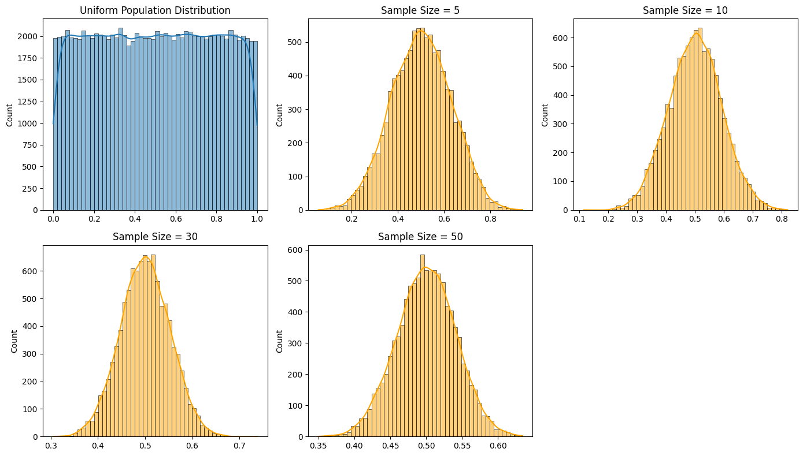

## Problem 1: Exploring the Central Limit Theorem through Simulations

### Motivation
The Central Limit Theorem (CLT) is one of the most important results in statistics. It asserts that, regardless of the population's distribution, the sampling distribution of the sample mean tends to a normal distribution as the sample size increases. This holds true under fairly general conditions and is a foundation for inferential statistics. Through simulation, we can empirically observe the CLT in action and better appreciate its practical implications.

### Task Overview
In this task, we explore the Central Limit Theorem by:
1. Generating populations with different distributions.
2. Drawing repeated samples of various sizes.
3. Observing the behavior of the sample means.
4. Visualizing the results.
5. Reflecting on real-world applications.

### Python Implementation
```python
import numpy as np
import matplotlib.pyplot as plt
import seaborn as sns

# Settings
np.random.seed(42)
n_samples = 10000
sample_sizes = [5, 10, 30, 50]

# Distribution Generators
distributions = {
    'Uniform': lambda n: np.random.uniform(0, 1, n),
    'Exponential': lambda n: np.random.exponential(scale=1.0, size=n),
    'Binomial': lambda n: np.random.binomial(n=10, p=0.5, size=n)
}

# Function to simulate sampling distribution of the mean
def simulate_sampling_distribution(dist_func, population_size=100000, sample_sizes=[5, 10, 30, 50]):
    population = dist_func(population_size)
    results = {}
    for size in sample_sizes:
        means = [np.mean(dist_func(size)) for _ in range(n_samples)]
        results[size] = means
    return results, population

# Plotting function
def plot_results(results, population, title_prefix):
    plt.figure(figsize=(14, 8))
    plt.subplot(2, 3, 1)
    sns.histplot(population, kde=True, bins=50)
    plt.title(f"{title_prefix} Population Distribution")

    for i, size in enumerate(results):
        plt.subplot(2, 3, i + 2)
        sns.histplot(results[size], kde=True, bins=50, color='orange')
        plt.title(f"Sample Size = {size}")

    plt.tight_layout()
    plt.show()

# Run simulation and visualization for each distribution
for name, dist_func in distributions.items():
    results, population = simulate_sampling_distribution(dist_func, sample_sizes=sample_sizes)
    plot_results(results, population, name)
```


### Observations & Discussion
- **Uniform Distribution**: Initially flat and non-normal, the sampling distributions converge quickly to a bell-shaped curve.
- **Exponential Distribution**: Highly skewed to begin with, but sample means approach normality as size increases.
- **Binomial Distribution**: Discrete distribution that becomes smooth and normal-shaped with larger samples.

### Parameter Exploration
- **Effect of Sample Size**: As the sample size increases, the variability of the sample means decreases and the shape converges toward normality.
- **Population Variance Impact**: Larger population variance leads to a wider spread in the sampling distribution, even after normalization.

### Practical Applications
- **Quality Control**: Detecting deviations from the mean product weight.
- **Polling and Surveys**: Estimating opinions or characteristics of large populations.
- **Finance**: Risk estimation, average returns modeling, and confidence intervals.

### Deliverables
- Python script for CLT simulation.
- Histograms showing sample mean convergence.
- Discussion connecting the observed patterns to theoretical expectations of the CLT.

This simulation reinforces the Central Limit Theorem's powerful role in statistics, demonstrating that even non-normal data leads to a normally distributed mean under sufficient sample sizes.

