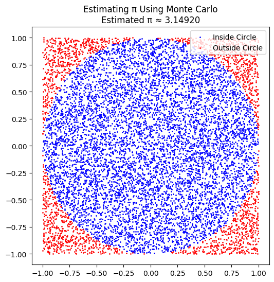
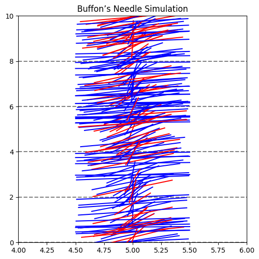

## Problem: Estimating $\pi$ Using Simulations

### PART 1: Estimating $\pi$ Using a Circle

#### 1. Theoretical Foundation
To estimate \( \pi \), we can use the **Monte Carlo method** with a unit circle inscribed in a square. The idea is to generate random points inside the square and count how many fall inside the circle.

Since the area of a unit circle is $\pi r^2 = \pi$ and the area of the square is $4$ (since its sides go from -1 to 1), the ratio of the circle’s area to the square’s area is $\pi / 4$. Therefore, we can estimate $\pi$ as:

$$
    \pi \approx 4 \times \frac{\text{points inside circle}}{\text{total points}}
$$

#### 2. Simulation
```python
import numpy as np
import matplotlib.pyplot as plt

# Monte Carlo simulation to estimate pi
def estimate_pi_circle(n_points):
    x = np.random.uniform(-1, 1, n_points)
    y = np.random.uniform(-1, 1, n_points)
    inside_circle = x**2 + y**2 <= 1
    pi_estimate = 4 * np.sum(inside_circle) / n_points
    return pi_estimate, x, y, inside_circle

# Run simulation
n_points = 10000
pi_est, x_vals, y_vals, in_circle = estimate_pi_circle(n_points)
print(f"Estimated π: {pi_est}")
```

#### 3. Visualization
```python
plt.figure(figsize=(6, 6))
plt.scatter(x_vals[in_circle], y_vals[in_circle], color='blue', s=1, label='Inside Circle')
plt.scatter(x_vals[~in_circle], y_vals[~in_circle], color='red', s=1, label='Outside Circle')
plt.gca().set_aspect('equal')
plt.title(f"Estimating π Using Monte Carlo\nEstimated π ≈ {pi_est:.5f}")
plt.legend()
plt.show()
```

#### 4. Analysis
- As the number of random points increases, the estimate becomes more accurate.
- The convergence is slow but consistent; doubling the points does not halve the error.
- This method demonstrates the strength of probabilistic approximation, but also its computational limitations.

---

### PART 2: Estimating $\pi$ Using Buffon’s Needle

#### 1. Theoretical Foundation
Buffon’s Needle is a classic probability method for estimating $\pi$. It involves dropping a needle of length $L$ on a plane with parallel lines spaced $t$ units apart.

The probability that the needle crosses a line is:

$$
    P = \frac{2L}{\pi t} \quad \text{(when } L \leq t)
$$

Rearranged to estimate \( \pi \):

$$
    \pi \approx \frac{2L \cdot N}{t \cdot C}
$$

Where:

- $L$ = needle length
- $t$ = distance between lines
- $N$ = number of throws
- $C$ = number of crossings

#### 2. Simulation
```python
import numpy as np

def estimate_pi_buffon(n_throws, L=1.0, t=2.0):
    x = np.random.uniform(0, t/2, n_throws)  # distance to closest line
    theta = np.random.uniform(0, np.pi/2, n_throws)  # angle with horizontal
    crosses = x <= (L/2) * np.sin(theta)
    C = np.sum(crosses)
    if C == 0:
        return None
    pi_estimate = (2 * L * n_throws) / (t * C)
    return pi_estimate, x, theta, crosses

# Run simulation
n_throws = 10000
pi_buffon, x_vals, theta_vals, cross_flags = estimate_pi_buffon(n_throws)
print(f"Estimated π via Buffon’s Needle: {pi_buffon:.5f}")
```

#### 3. Visualization
```python
import matplotlib.pyplot as plt

lines_y = np.arange(0, 10, 2)
plt.figure(figsize=(6, 6))
for y in lines_y:
    plt.axhline(y, color='gray', linestyle='--')

for i in range(200):
    y_center = np.random.uniform(0, 10)
    theta = theta_vals[i]
    x_start = 5 - (np.cos(theta)/2)
    x_end = 5 + (np.cos(theta)/2)
    y_start = y_center - (np.sin(theta)/2)
    y_end = y_center + (np.sin(theta)/2)
    color = 'red' if cross_flags[i] else 'blue'
    plt.plot([x_start, x_end], [y_start, y_end], color=color)

plt.title("Buffon’s Needle Simulation")
plt.xlim(4, 6)
plt.ylim(0, 10)
plt.show()
```


#### 4. Analysis
- Buffon’s Needle is elegant but has a **high variance**, meaning estimates can fluctuate.
- Requires a **large number of trials** for accuracy.
- Useful in demonstrating connections between **geometry, probability, and estimation**.

---

### Deliverables
- Python scripts for both methods.
- Plots: circle hit/miss and Buffon’s needle visuals.
- Markdown write-up including:
  - Theoretical foundations
  - Visual and numerical results
  - Accuracy and convergence comparisons

### Hints & Resources
- Use `NumPy` for randomness and `Matplotlib` for plotting.
- Buffon’s method requires careful simulation of geometry (angle + distance).
- Monte Carlo circle method is simpler and converges more consistently.
- Run multiple trials or increase iterations to explore accuracy.

---

### Summary
Both methods estimate $\pi$ through randomness:
- The **circle-based Monte Carlo** method is easier and more consistent.
- **Buffon’s Needle** is more mathematically elegant but converges slowly.
Each illustrates important statistical and computational ideas through simulation.

